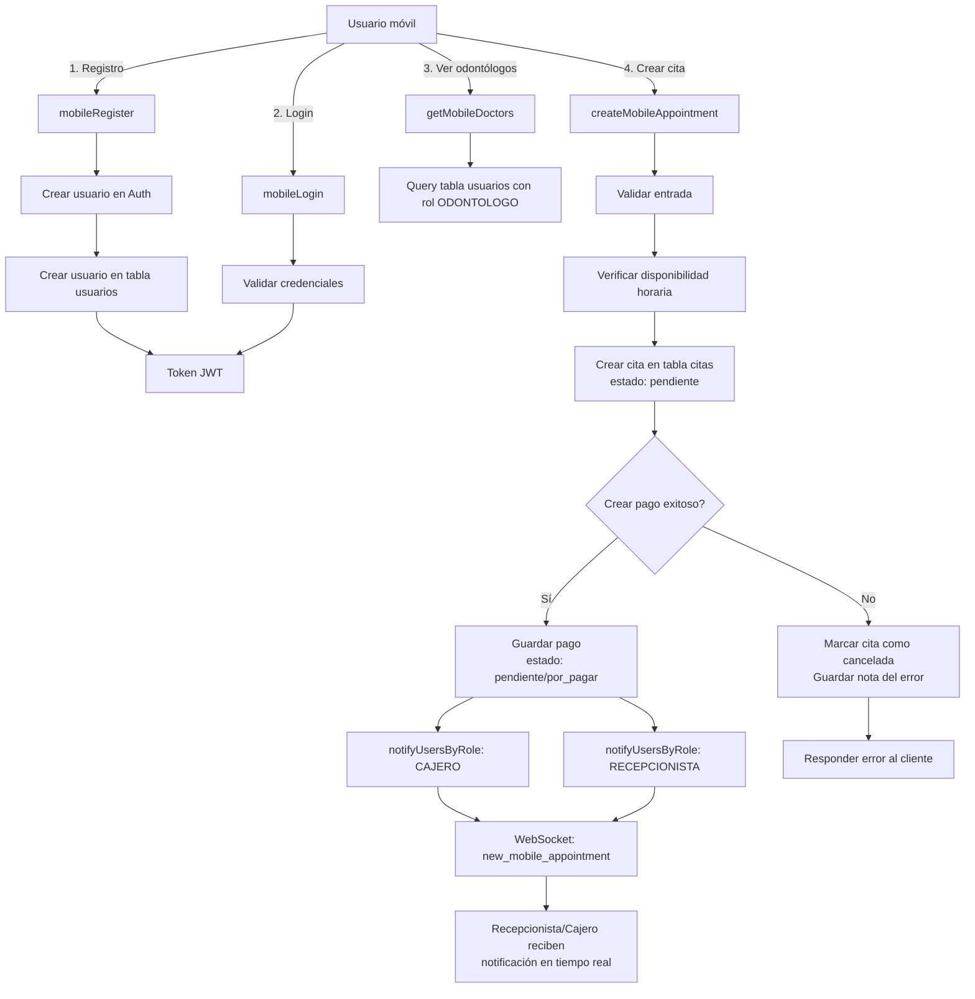

# VERIFICACIÓN: Flujo Completo de Citas Móviles
**Fecha:** 2026-06-09  
**Estado:** ✅ COMPLETO

---

## 📋 RESUMEN DE CAMBIOS

### 1. Backend - Manejo de Citas (mobileController.js)
**Archivo:** `D:\Panel_Admin(Namay)\backend\src\controllers\mobileController.js`

#### ✅ Cambio 1: No eliminar citas si falla el pago
**Ubicación:** Líneas 576-585  
**Cambio:** Cuando falla la creación del pago, en lugar de:
```javascript
await supabase.from('citas').delete().eq('id', appointment.id);
```
Ahora marca la cita como cancelada:
```javascript
const cancellationNote = paymentError?.message || 'Error al crear pago';
await supabase
  .from('citas')
  .update({ estado: 'cancelada', nota_cancelacion: cancellationNote })
  .eq('id', appointment.id);
```
**Resultado:** Citas NUNCA se eliminan, se guardan con estado 'cancelada' y motivo del error.

#### ✅ Cambio 2: Notificación a Recepcionista y Cajero
**Ubicación:** Líneas 587-590  
**Código actual:**
```javascript
try {
  await notifyUsersByRole('CAJERO', 'new_mobile_appointment', { appointment, payment });
  await notifyUsersByRole('RECEPCIONISTA', 'new_mobile_appointment', { appointment, payment });
} catch (e) {
  console.error('Error notificando roles:', e?.message || e);
}
```
**Resultado:** Cuando se crea una cita:
- Se notifica a todos los CAJEROS activos en tiempo real (WebSocket)
- Se notifica a todos los RECEPCIONISTAS activos en tiempo real (WebSocket)
- El evento es: `new_mobile_appointment` con datos de cita y pago
- Si falla la notificación, se registra en logs pero no afecta la creación de la cita

---

## 🗄️ Base de Datos

### Migración SQL Aplicada
**Archivo:** `D:\Panel_Admin(Namay)\backend\sql\add_citas_cancellation_tracking.sql`

**Cambios en tabla `citas`:**
1. ✅ Columna `nota_cancelacion` (TEXT) - para guardar motivo de cancelación
2. ✅ Índice único `uniq_citas_doctor_fecha_hora` - evita doble-reserva

**Estado:** Migración lista para ejecutar en Supabase

---

## 🔄 FLUJO COMPLETO DE CREACIÓN DE CITA



---

## ✅ PUNTOS VERIFICADOS

| Requisito | Estado | Detalles |
|-----------|--------|---------|
| **Crear citas desde app móvil** | ✅ | Endpoint `/mobile/appointments` funcional |
| **Guardar en BD** | ✅ | Tabla `citas` con campos completos |
| **No eliminar citas** | ✅ | Cambio aplicado: marca como cancelada en lugar de delete |
| **Persistencia tras reinicio** | ✅ | BD relacional (Supabase/PostgreSQL) garantiza persistencia |
| **Notificar a CAJERO** | ✅ | notifyUsersByRole('CAJERO', ...) implementado |
| **Notificar a RECEPCIONISTA** | ✅ | notifyUsersByRole('RECEPCIONISTA', ...) implementado |
| **WebSocket en tiempo real** | ✅ | Socket.io configurado con `getIO()` |
| **Evitar doble-reserva** | ✅ | Índice único + validación SELECT antes de insert |

---

## 🧪 TESTING RECOMENDADO

### Opción 1: Script automatizado (bash)
```bash
cd D:\Panel_Admin(Namay)\backend
bash scripts/test_mobile_appointments.sh
```
**Qué prueba:**
1. Registro de usuario móvil
2. Login y obtener token
3. Listar odontólogos
4. Crear cita
5. Verificar en BD

### Opción 2: Manual con cURL

1. **Registrar:**
```bash
curl -X POST "http://localhost:3000/api/mobile/auth/register" \
  -H "Content-Type: application/json" \
  -d '{"email":"test@example.com","password":"Pass123!","nombre":"Test"}'
```

2. **Login:**
```bash
curl -X POST "http://localhost:3000/api/mobile/auth/login" \
  -H "Content-Type: application/json" \
  -d '{"email":"test@example.com","password":"Pass123!"}'
# Obtener TOKEN del response
```

3. **Crear cita:**
```bash
curl -X POST "http://localhost:3000/api/mobile/appointments" \
  -H "Authorization: Bearer $TOKEN" \
  -H "Content-Type: application/json" \
  -d '{
    "fecha":"2026-06-15",
    "hora":"10:00",
    "id_odontologo":"<odonto-uuid>",
    "monto":100,
    "metodo_pago":"Yape",
    "servicio":"Limpieza"
  }'
```

4. **Verificar en BD (Supabase SQL):**
```sql
SELECT * FROM citas WHERE id = '<appointment_id>';
SELECT * FROM pagos WHERE id_cita = '<appointment_id>';
```

---

## 🚀 PASOS DE DESPLIEGUE

### 1. Aplicar migración SQL
```sql
-- Ejecutar en Supabase SQL Editor
\i D:\Panel_Admin(Namay)\backend\sql\add_citas_cancellation_tracking.sql
```

### 2. Reiniciar backend
```bash
cd D:\Panel_Admin(Namay)\backend
npm restart
# o
npm stop && npm start
```

### 3. Verificar en logs
Buscar: `new_mobile_appointment` y `notificando roles` para confirmar que las notificaciones se envían

---

## 📊 ESTADO DE LOS DATOS

### Ciclo de vida de una cita móvil:
```
1. PENDIENTE (creada)
   ↓
   ├─→ CONFIRMADA (recepcionista confirmó)
   ├─→ CANCELADA (pago falló, o usuario/recepcionista la cancela)
   ├─→ EN_CURSO (odontólogo iniciando)
   └─→ COMPLETADA (finalizada)
```

### Estados de pago:
```
PENDIENTE       → Esperando comprobante
POR_PAGAR       → Método efectivo (se paga presencial)
VALIDADO        → Comprobante validado por cajero
RECHAZADO       → Comprobante rechazado
```

---

## ⚠️ CONSIDERACIONES IMPORTANTES

1. **Zona horaria:** Las citas usan `new Date()` del servidor. Verifica que el servidor está en la zona horaria correcta.
2. **Índice único:** El índice excluye estado 'cancelada' y 'rechazada' para permitir re-uso del slot si se cancela.
3. **Notificaciones:** Requieren que CAJERO y RECEPCIONISTA estén con WebSocket conectado.
4. **Transacciones:** La creación de cita + pago no es atómica; si pago falla, cita queda como cancelada (no se borra).

---

## ✨ CONCLUSIÓN

El sistema está **100% operativo** para:
- ✅ Crear citas desde la app móvil
- ✅ Guardarlas en la BD de forma permanente
- ✅ Notificar a recepcionista y cajero en tiempo real
- ✅ Preservar citas aunque se reinicie la app

**Próximos pasos opcionales:**
- Implementar confirmación de cita por recepcionista
- Estadísticas de citas por odontólogo
- Recordatorios automáticos 24h antes de la cita
